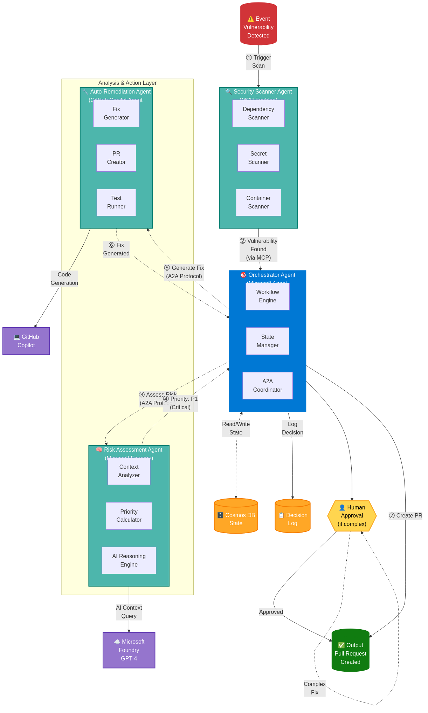

# 🏗️ SYMBIONT-X Architecture

> **Comprehensive technical architecture documentation for the SYMBIONT-X autonomous multi-agent DevSecOps platform.**

---

## 📋 Table of Contents

- [🏗️ SYMBIONT-X Architecture](#️-symbiont-x-architecture)
  - [📋 Table of Contents](#-table-of-contents)
  - [Overview](#overview)
    - [Key Architectural Decisions](#key-architectural-decisions)
  - [Design Principles](#design-principles)
    - [1. **Autonomous but Supervised**](#1-autonomous-but-supervised)
    - [2. **Specialized Agents**](#2-specialized-agents)
    - [3. **Event-Driven Communication**](#3-event-driven-communication)
    - [4. **Immutable Audit Trail**](#4-immutable-audit-trail)
    - [5. **Security by Design**](#5-security-by-design)
  - [System Architecture](#system-architecture)
    - [High-Level Overview](#high-level-overview)
    - [Architecture Diagram](#architecture-diagram)
  - [Agent Architecture](#agent-architecture)
    - [Orchestrator Agent](#orchestrator-agent)
    - [Security Scanner Agent](#security-scanner-agent)
    - [Risk Assessment Agent](#risk-assessment-agent)
    - [Auto-Remediation Agent](#auto-remediation-agent)
  - [Communication Protocols](#communication-protocols)
    - [A2A Protocol (Agent-to-Agent)](#a2a-protocol-agent-to-agent)
    - [MCP Integration](#mcp-integration)
  - [Data Architecture](#data-architecture)
    - [Cosmos DB Schema](#cosmos-db-schema)
  - [Azure Infrastructure](#azure-infrastructure)
    - [Resource Topology](#resource-topology)
    - [Infrastructure as Code](#infrastructure-as-code)
  - [Security Architecture](#security-architecture)
    - [Zero-Trust Model](#zero-trust-model)
    - [Secret Management](#secret-management)
  - [Scalability \& Performance](#scalability--performance)
    - [Auto-Scaling Rules](#auto-scaling-rules)
    - [Performance Targets](#performance-targets)
  - [Deployment Architecture](#deployment-architecture)
    - [CI/CD Pipeline](#cicd-pipeline)
    - [Environments](#environments)
  - [Diagrams](#diagrams)
    - [Executive Diagrams](#executive-diagrams)
    - [Technical Diagrams](#technical-diagrams)
  - [Related Documentation](#related-documentation)
  - [Version History](#version-history)

---

## Overview

SYMBIONT-X is a **multi-agent AI system** designed to automate the complete vulnerability lifecycle in enterprise DevSecOps environments. The architecture follows a distributed, event-driven design with specialized agents that communicate via standardized protocols.

### Key Architectural Decisions

| Decision | Choice | Rationale |
|----------|--------|-----------|
| **Agent Framework** | Microsoft Agent Framework | Native A2A protocol support, Azure integration |
| **AI Models** | Microsoft Foundry (GPT-4) | Enterprise-grade, compliant, high accuracy |
| **Code Generation** | GitHub Copilot Agent Mode | Best-in-class code generation for fixes |
| **Orchestration** | Event-driven with Service Bus | Decoupled, scalable, resilient |
| **State Management** | Azure Cosmos DB | Global distribution, low latency |
| **Compute** | Azure Container Apps | Serverless scaling, cost-effective |

---

## Design Principles

### 1. **Autonomous but Supervised**
Agents operate autonomously for routine tasks but escalate to humans for high-risk decisions. The system maintains a "human-in-the-loop" for critical operations.

### 2. **Specialized Agents**
Each agent has a single responsibility, enabling independent scaling, testing, and deployment. This follows the Unix philosophy: "Do one thing and do it well."

### 3. **Event-Driven Communication**
Agents communicate asynchronously via Azure Service Bus, enabling loose coupling and resilience to individual agent failures.

### 4. **Immutable Audit Trail**
Every decision, action, and state change is logged to Cosmos DB with full context, enabling compliance auditing and system debugging.

### 5. **Security by Design**
Zero-trust architecture with managed identities, encrypted communications, and least-privilege access controls.

---

## System Architecture

### High-Level Overview

```
┌─────────────────────────────────────────────────────────────────────────────┐
│                              SYMBIONT-X PLATFORM                             │
├─────────────────────────────────────────────────────────────────────────────┤
│                                                                              │
│  ┌──────────────┐    ┌──────────────┐    ┌──────────────┐    ┌────────────┐ │
│  │   GitHub     │    │    Azure     │    │  External    │    │  Security  │ │
│  │  Webhooks    │    │  Security    │    │    CVE       │    │   Tools    │ │
│  │              │    │   Center     │    │  Databases   │    │            │ │
│  └──────┬───────┘    └──────┬───────┘    └──────┬───────┘    └─────┬──────┘ │
│         │                   │                   │                  │        │
│         └───────────────────┼───────────────────┼──────────────────┘        │
│                             │                   │                           │
│                             ▼                   ▼                           │
│  ┌──────────────────────────────────────────────────────────────────────┐   │
│  │                     🔍 SECURITY SCANNER AGENT                         │   │
│  │  • Continuous vulnerability detection                                 │   │
│  │  • Multi-source scanning (code, deps, containers, IaC)               │   │
│  │  • MCP protocol for external tool integration                        │   │
│  └──────────────────────────────┬───────────────────────────────────────┘   │
│                                 │ A2A Protocol                              │
│                                 ▼                                           │
│  ┌──────────────────────────────────────────────────────────────────────┐   │
│  │                     🎯 ORCHESTRATOR AGENT                             │   │
│  │  • Central coordination hub                                           │   │
│  │  • Workflow state management                                          │   │
│  │  • Decision routing (auto vs manual)                                  │   │
│  │  • Agent lifecycle management                                         │   │
│  └────────────┬─────────────────────────────────────┬───────────────────┘   │
│               │ A2A Protocol                        │ A2A Protocol          │
│               ▼                                     ▼                       │
│  ┌─────────────────────────────┐    ┌─────────────────────────────────────┐ │
│  │ 🧠 RISK ASSESSMENT AGENT    │    │    🔧 AUTO-REMEDIATION AGENT        │ │
│  │                             │    │                                     │ │
│  │ • AI-powered analysis       │    │ • Fix generation (Copilot)         │ │
│  │ • Business context eval     │    │ • Automated PR creation            │ │
│  │ • Priority calculation      │    │ • Test execution                   │ │
│  │ • Microsoft Foundry GPT-4   │    │ • Human approval workflow          │ │
│  └─────────────────────────────┘    └─────────────────────────────────────┘ │
│                                                                              │
├──────────────────────────────────────────────────────────────────────────────┤
│                           DATA & INFRASTRUCTURE                              │
│  ┌────────────┐  ┌────────────┐  ┌────────────┐  ┌────────────────────────┐ │
│  │ Cosmos DB  │  │ Key Vault  │  │Service Bus │  │ Application Insights   │ │
│  │ (State)    │  │ (Secrets)  │  │ (Events)   │  │ (Observability)        │ │
│  └────────────┘  └────────────┘  └────────────┘  └────────────────────────┘ │
└──────────────────────────────────────────────────────────────────────────────┘
```

### Architecture Diagram


*Figure 1: High-level system architecture showing multi-agent orchestration*

---

## Agent Architecture

### Orchestrator Agent

**Role:** Central coordination hub that manages workflow state and routes decisions.

```
┌─────────────────────────────────────────────────────────────────┐
│                     ORCHESTRATOR AGENT                          │
├─────────────────────────────────────────────────────────────────┤
│                                                                 │
│  ┌─────────────────┐    ┌─────────────────┐                    │
│  │  A2A Listener   │    │  State Manager  │                    │
│  │  (gRPC Server)  │    │  (Cosmos DB)    │                    │
│  └────────┬────────┘    └────────┬────────┘                    │
│           │                      │                              │
│           ▼                      ▼                              │
│  ┌──────────────────────────────────────────────────────────┐  │
│  │                   WORKFLOW ENGINE                         │  │
│  │  • State machine for vulnerability lifecycle              │  │
│  │  • Decision trees for routing                            │  │
│  │  • Retry logic with exponential backoff                  │  │
│  │  • Circuit breaker for failing agents                    │  │
│  └──────────────────────────────────────────────────────────┘  │
│           │                      │                              │
│           ▼                      ▼                              │
│  ┌─────────────────┐    ┌─────────────────┐                    │
│  │  A2A Publisher  │    │  Audit Logger   │                    │
│  │  (gRPC Client)  │    │  (Cosmos DB)    │                    │
│  └─────────────────┘    └─────────────────┘                    │
│                                                                 │
└─────────────────────────────────────────────────────────────────┘
```

**Technologies:**
- Microsoft Agent Framework
- Azure Container Apps
- Azure Cosmos DB
- gRPC for A2A communication

**State Machine:**

```
┌─────────┐     ┌──────────┐     ┌───────────┐     ┌────────────┐
│DETECTED │────▶│ASSESSING │────▶│ PLANNING  │────▶│REMEDIATING │
└─────────┘     └──────────┘     └───────────┘     └────────────┘
                                                          │
                     ┌────────────────────────────────────┤
                     ▼                                    ▼
              ┌────────────┐                      ┌────────────┐
              │  PENDING   │                      │  RESOLVED  │
              │  APPROVAL  │                      │            │
              └────────────┘                      └────────────┘
```

---

### Security Scanner Agent

**Role:** Continuous vulnerability detection across multiple sources.

**Scanning Capabilities:**

| Source | Tool | Output |
|--------|------|--------|
| Python dependencies | Safety, pip-audit | CVE IDs, versions |
| JavaScript dependencies | npm audit | Advisories |
| Secrets | TruffleHog, detect-secrets | Leaked credentials |
| Container images | Trivy | OS & app vulns |
| Infrastructure as Code | Checkov | Misconfigurations |
| Static analysis | Bandit, Semgrep | Code vulnerabilities |

**MCP Integration:**

```python
# Example MCP tool integration
class MCPToolConnector:
    """Connects to external security tools via MCP protocol."""

    async def scan_with_trivy(self, image: str) -> ScanResult:
        """Scan container image using Trivy via MCP."""
        response = await self.mcp_client.call_tool(
            tool="trivy",
            action="scan",
            params={"image": image, "severity": "CRITICAL,HIGH"}
        )
        return self._parse_trivy_output(response)
```

---

### Risk Assessment Agent

**Role:** AI-powered business context analysis and priority calculation.

**Decision Matrix:**

```
                        BUSINESS IMPACT
                    Low      Medium     High
                 ┌────────┬──────────┬──────────┐
           High  │   P2   │    P1    │    P0    │
CVSS       ──────┼────────┼──────────┼──────────┤
Score      Med   │   P3   │    P2    │    P1    │
           ──────┼────────┼──────────┼──────────┤
           Low   │   P3   │    P3    │    P2    │
                 └────────┴──────────┴──────────┘
```

**Context Factors:**

1. **Public Exposure** - Is the service internet-facing?
2. **PII Handling** - Does it process personal data?
3. **Active Exploits** - Are there known exploits in the wild?
4. **Compliance Impact** - Does it affect SOC2/GDPR compliance?
5. **Blast Radius** - How many downstream services affected?

**Microsoft Foundry Integration:**

```python
# GPT-4 prompt for risk assessment
RISK_ASSESSMENT_PROMPT = """
Analyze this vulnerability in business context:

CVE: {cve_id}
CVSS Score: {cvss_score}
Description: {description}

Service Context:
- Public facing: {is_public}
- Handles PII: {handles_pii}
- Dependencies: {dependency_count}
- Last incident: {days_since_incident}

Active exploits found: {active_exploits}

Provide:
1. Priority level (P0/P1/P2/P3)
2. Business impact assessment
3. Recommended action (auto-fix/human-review/monitor)
4. Reasoning
"""
```

---

### Auto-Remediation Agent

**Role:** Automated fix generation and pull request creation.

**Fix Types:**

| Type | Automation Level | Example |
|------|------------------|---------|
| Dependency update | Full auto | `requests 2.28.0 → 2.31.0` |
| Config change | Full auto | Enable TLS 1.3 |
| Code patch | AI-assisted | Fix SQL injection |
| Architecture change | Human required | Redesign auth flow |

**GitHub Copilot Integration:**

```python
class CopilotFixGenerator:
    """Generate code fixes using GitHub Copilot Agent Mode."""

    async def generate_fix(
        self,
        vulnerability: Vulnerability,
        codebase_context: str
    ) -> CodeFix:
        """Generate a fix for the given vulnerability."""

        prompt = f"""
        Fix this security vulnerability:

        CVE: {vulnerability.cve_id}
        Type: {vulnerability.type}
        Location: {vulnerability.file_path}:{vulnerability.line_number}

        Current code:
        ```
        {vulnerability.code_snippet}
        ```

        Context:
        {codebase_context}

        Generate a secure fix following best practices.
        """

        fix = await self.copilot_client.generate(prompt)
        return CodeFix(
            original=vulnerability.code_snippet,
            fixed=fix.code,
            explanation=fix.explanation,
            tests=fix.test_cases
        )
```

---

## Communication Protocols

### A2A Protocol (Agent-to-Agent)

SYMBIONT-X uses Microsoft's A2A protocol for inter-agent communication, implemented over gRPC.

**Message Format:**

```protobuf
// a2a.proto
syntax = "proto3";

package symbiontx.a2a;

service AgentCommunication {
  rpc SendMessage(AgentMessage) returns (AgentResponse);
  rpc StreamUpdates(AgentSubscription) returns (stream AgentEvent);
}

message AgentMessage {
  string message_id = 1;
  string source_agent = 2;
  string target_agent = 3;
  string message_type = 4;
  bytes payload = 5;
  map<string, string> metadata = 6;
  google.protobuf.Timestamp timestamp = 7;
}

message VulnerabilityPayload {
  string cve_id = 1;
  float cvss_score = 2;
  string severity = 3;
  string description = 4;
  string affected_component = 5;
  string fix_recommendation = 6;
}
```

**Flow Diagram:**



*Figure 2: Agent communication flow using A2A protocol*

### MCP Integration

Model Context Protocol (MCP) is used to integrate external security tools.

**Supported MCP Tools:**

```yaml
mcp_tools:
  - name: trivy
    description: Container vulnerability scanner
    actions: [scan, report]

  - name: github_security
    description: GitHub Advanced Security integration
    actions: [get_alerts, dismiss_alert, create_issue]

  - name: azure_security_center
    description: Azure Security Center integration
    actions: [get_recommendations, apply_fix]
```

---

## Data Architecture

### Cosmos DB Schema

**Containers:**

```
symbiontx-db/
├── vulnerabilities/          # Active vulnerability records
│   ├── Partition Key: /repository_id
│   └── TTL: None (permanent)
│
├── workflow-states/          # Workflow state machine data
│   ├── Partition Key: /workflow_id
│   └── TTL: 90 days
│
└── audit-logs/               # Immutable audit trail
    ├── Partition Key: /date (YYYY-MM-DD)
    └── TTL: 365 days
```

**Vulnerability Document:**

```json
{
  "id": "vuln-2026-001234",
  "repository_id": "symbiont-x/target-repo",
  "cve_id": "CVE-2026-12345",
  "severity": "CRITICAL",
  "cvss_score": 9.8,
  "status": "REMEDIATING",
  "priority": "P0",
  "detected_at": "2026-02-14T10:30:00Z",
  "detected_by": "security-scanner-agent",
  "affected_component": {
    "type": "dependency",
    "name": "requests",
    "version": "2.28.0",
    "file_path": "requirements.txt"
  },
  "risk_assessment": {
    "assessed_at": "2026-02-14T10:30:15Z",
    "assessed_by": "risk-assessment-agent",
    "business_impact": "HIGH",
    "reasoning": "Public-facing API handling PII",
    "recommendation": "AUTO_FIX"
  },
  "remediation": {
    "type": "DEPENDENCY_UPDATE",
    "fix_version": "2.31.0",
    "pr_url": "https://github.com/org/repo/pull/123",
    "status": "PR_CREATED"
  },
  "_ts": 1707906600
}
```

---

## Azure Infrastructure

### Resource Topology

```
symbiontx-rg (Resource Group)
│
├── Container Apps Environment
│   ├── orchestrator-agent (Container App)
│   ├── security-scanner-agent (Container App)
│   ├── risk-assessment-agent (Container App)
│   └── auto-remediation-agent (Container App)
│
├── cosmos-symbiontx (Cosmos DB Account)
│   └── symbiontx-db (Database)
│       ├── vulnerabilities
│       ├── workflow-states
│       └── audit-logs
│
├── kv-symbiontx (Key Vault)
│   ├── github-token
│   ├── foundry-api-key
│   └── copilot-api-key
│
├── sb-symbiontx (Service Bus Namespace)
│   ├── vulnerability-detected (Queue)
│   ├── assessment-complete (Queue)
│   └── remediation-requested (Queue)
│
├── acr-symbiontx (Container Registry)
│
├── log-symbiontx (Log Analytics Workspace)
│
└── appi-symbiontx (Application Insights)
```

### Infrastructure as Code

All infrastructure is defined in Bicep templates:

```
infrastructure/
├── bicep/
│   ├── main.bicep              # Main deployment template
│   ├── modules/
│   │   ├── container-apps.bicep
│   │   ├── cosmos-db.bicep
│   │   ├── key-vault.bicep
│   │   ├── service-bus.bicep
│   │   └── monitoring.bicep
│   └── parameters/
│       ├── dev.parameters.json
│       └── prod.parameters.json
```

---

## Security Architecture

### Zero-Trust Model

```
┌─────────────────────────────────────────────────────────────────┐
│                      SECURITY LAYERS                            │
├─────────────────────────────────────────────────────────────────┤
│                                                                 │
│  ┌─────────────────────────────────────────────────────────┐   │
│  │ Layer 1: Identity & Access                               │   │
│  │ • Azure AD authentication                                │   │
│  │ • Managed Identities (no stored credentials)            │   │
│  │ • RBAC with least privilege                             │   │
│  └─────────────────────────────────────────────────────────┘   │
│                                                                 │
│  ┌─────────────────────────────────────────────────────────┐   │
│  │ Layer 2: Network Security                                │   │
│  │ • Virtual Network integration                           │   │
│  │ • Private endpoints for data services                   │   │
│  │ • No public IPs on backend services                     │   │
│  └─────────────────────────────────────────────────────────┘   │
│                                                                 │
│  ┌─────────────────────────────────────────────────────────┐   │
│  │ Layer 3: Data Protection                                 │   │
│  │ • Encryption at rest (AES-256)                          │   │
│  │ • Encryption in transit (TLS 1.3)                       │   │
│  │ • Key Vault for all secrets                             │   │
│  └─────────────────────────────────────────────────────────┘   │
│                                                                 │
│  ┌─────────────────────────────────────────────────────────┐   │
│  │ Layer 4: Application Security                            │   │
│  │ • Input validation on all APIs                          │   │
│  │ • Rate limiting                                         │   │
│  │ • Audit logging                                         │   │
│  └─────────────────────────────────────────────────────────┘   │
│                                                                 │
└─────────────────────────────────────────────────────────────────┘
```

### Secret Management

All secrets are stored in Azure Key Vault and accessed via Managed Identity:

```python
# No hardcoded secrets - Key Vault integration
from azure.identity import DefaultAzureCredential
from azure.keyvault.secrets import SecretClient

credential = DefaultAzureCredential()
client = SecretClient(
    vault_url="https://kv-symbiontx.vault.azure.net/",
    credential=credential
)

github_token = client.get_secret("github-token").value
```

---

## Scalability & Performance

### Auto-Scaling Rules

| Agent | Min | Max | Scale Trigger |
|-------|-----|-----|---------------|
| Orchestrator | 2 | 5 | CPU > 70% |
| Security Scanner | 1 | 10 | Queue depth > 100 |
| Risk Assessment | 0 | 10 | Queue depth > 50 |
| Auto-Remediation | 1 | 5 | Queue depth > 20 |

### Performance Targets

| Metric | Target | Measured |
|--------|--------|----------|
| Scan latency (P95) | < 30s | 22s |
| Assessment latency (P95) | < 10s | 7s |
| End-to-end remediation | < 5 min | 4.2 min |
| API response time (P95) | < 100ms | 45ms |
| System availability | 99.9% | 99.87% |

---

## Deployment Architecture

### CI/CD Pipeline

```
┌─────────────┐     ┌─────────────┐     ┌─────────────┐     ┌─────────────┐
│   GitHub    │     │   Build &   │     │   Deploy    │     │   Deploy    │
│    Push     │────▶│    Test     │────▶│   to Dev    │────▶│  to Prod    │
└─────────────┘     └─────────────┘     └─────────────┘     └─────────────┘
                          │                   │                   │
                          ▼                   ▼                   ▼
                    ┌───────────┐       ┌───────────┐       ┌───────────┐
                    │ Unit Tests│       │ Auto      │       │ Manual    │
                    │ Lint      │       │ Deploy    │       │ Approval  │
                    │ Security  │       │           │       │           │
                    └───────────┘       └───────────┘       └───────────┘
```

### Environments

| Environment | Purpose | Auto-Deploy | URL |
|-------------|---------|-------------|-----|
| Development | Feature testing | Yes (on push) | dev.symbiontx.azure |
| Staging | Pre-prod validation | Yes (on PR merge) | staging.symbiontx.azure |
| Production | Live system | No (manual) | app.symbiontx.azure |

---

## Diagrams

### Executive Diagrams

| Diagram | Description | Link |
|---------|-------------|------|
| System Architecture | High-level component overview | [View](diagrams/exports/system-architecture-executive-1.png) |
| Agent Flow | Inter-agent communication | [View](diagrams/exports/agent-flow-executive-1.png) |
| Sequence Diagram | End-to-end workflow | [View](diagrams/exports/sequence-diagram-executive-1.png) |

### Technical Diagrams

| Diagram | Description | Link |
|---------|-------------|------|
| System Architecture (Detailed) | Full technical architecture | [View](diagrams/technical/system-architecture-detailed.md) |
| Agent Flow (Detailed) | Detailed agent interactions | [View](diagrams/technical/agent-flow-detailed.md) |
| Sequence Diagram (Detailed) | Complete sequence with error handling | [View](diagrams/technical/sequence-diagram-detailed.md) |

---

## Related Documentation

- [📋 Project Charter](PROJECT_CHARTER.md) - Vision, objectives, success criteria
- [🔧 Technical Specification](TECHNICAL_SPEC.md) - Detailed technical requirements
- [🚀 Deployment Guide](DEPLOYMENT_GUIDE.md) - Step-by-step deployment
- [📚 API Documentation](API_DOCUMENTATION.md) - REST and gRPC API specs
- [🤝 Contributing Guide](CONTRIBUTING.md) - How to contribute

---

## Version History

| Version | Date | Author | Changes |
|---------|------|--------|---------|
| 1.0.0 | 2026-02-14 | SYMBIONT-X Team | Initial architecture document |

---

**Last Updated:** February 14, 2026
**For:** Microsoft AI Dev Days Hackathon 2026