# SYMBIONT-X - Agent Communication Flow (Executive View)

**Purpose:** Show how agents communicate and coordinate  
**Focus:** A2A protocol and multi-agent orchestration  

---

## Agent Flow Diagram

```mermaid
graph TB
    START[("⚠️ Event<br/>Vulnerability<br/>Detected")]

    subgraph Scanner["🔍 Security Scanner Agent<br/>(MCP Enabled)"]
        DEP["Dependency<br/>Scanner"]
        SEC["Secret<br/>Scanner"]
        CON["Container<br/>Scanner"]
    end

    subgraph Orchestrator["🎯 Orchestrator Agent<br/>(Microsoft Agent Framework)"]
        WF["Workflow<br/>Engine"]
        SM["State<br/>Manager"]
        A2A["A2A<br/>Coordinator"]
    end

    STATE[("🗄️ Cosmos DB<br/>State")]
    LOG[("📋 Decision<br/>Log")]

    subgraph Analysis["Analysis & Action Layer"]
        subgraph Risk["🧠 Risk Assessment Agent<br/>(Microsoft Foundry)"]
            CA["Context<br/>Analyzer"]
            PC["Priority<br/>Calculator"]
            AIR["AI Reasoning<br/>Engine"]
        end

        subgraph Remediation["🔧 Auto-Remediation Agent<br/>(GitHub Copilot Agent Mode)"]
            FG["Fix<br/>Generator"]
            PR["PR<br/>Creator"]
            TR["Test<br/>Runner"]
        end
    end

    HITL{{"👤 Human<br/>Approval<br/>(if complex)"}}

    OUTPUT[("✅ Output<br/>Pull Request<br/>Created")]

    %% Main Flow
    START -->|"① Trigger<br/>Scan"| Scanner
    Scanner -->|"② Vulnerability<br/>Found<br/>(via MCP)"| Orchestrator
    
    Orchestrator <-.->|"Read/Write<br/>State"| STATE
    
    Orchestrator -.->|"③ Assess Risk<br/>(A2A Protocol)"| Risk
    Risk -->|"AI Context<br/>Query"| MF["☁️ Microsoft<br/>Foundry<br/>GPT-4"]
    Risk -.->|"④ Priority: P1<br/>(Critical)"| Orchestrator
    
    Orchestrator -->|"Log<br/>Decision"| LOG
    
    Orchestrator -.->|"⑤ Generate Fix<br/>(A2A Protocol)"| Remediation
    Remediation -->|"Code<br/>Generation"| GHC["💻 GitHub<br/>Copilot"]
    Remediation -.->|"⑥ Fix<br/>Generated"| Orchestrator
    
    Orchestrator --> HITL
    HITL -->|"Approved"| OUTPUT
    HITL -.->|"Complex<br/>Fix"| HITL
    
    Orchestrator -->|"⑦ Create PR"| OUTPUT

    %% Styling
    classDef startEnd fill:#D13438,stroke:#D13438,color:#fff,stroke-width:3px
    classDef agent fill:#4DB6AC,stroke:#00796B,color:#fff,stroke-width:2px
    classDef orchestrator fill:#0078D4,stroke:#0078D4,color:#fff,stroke-width:3px
    classDef data fill:#FFA726,stroke:#F57C00,color:#fff,stroke-width:2px
    classDef success fill:#107C10,stroke:#107C10,color:#fff,stroke-width:3px
    classDef decision fill:#FFD54F,stroke:#F9A825,color:#000,stroke-width:2px
    classDef external fill:#9575CD,stroke:#5E35B1,color:#fff,stroke-width:2px

    class START startEnd
    class Scanner,Risk,Remediation agent
    class Orchestrator orchestrator
    class STATE,LOG data
    class OUTPUT success
    class HITL decision
    class MF,GHC external
```

---

**Version**: 1.0 | **Date**: February 2026 | **Project**: SYMBIONT-X
