# SYMBIONT-X - Complete Vulnerability Remediation Flow

**Purpose:** End-to-end temporal flow from detection to PR  
**Timeline**: ~5 minutes total  

---

## Sequence Diagram

```mermaid
sequenceDiagram
    autonumber
    participant GH as 📦 GitHub
    participant SS as 🔍 Security<br/>Scanner
    participant ORC as 🎯 Orchestrator
    participant DB as 🗄️ Cosmos DB
    participant RA as 🧠 Risk<br/>Assessment
    participant MF as ☁️ Microsoft<br/>Foundry
    participant AR as 🔧 Auto-<br/>Remediation
    participant GHC as 💻 GitHub<br/>Copilot

    Note over GH,GHC: T+0s: Developer commits code
    
    GH->>SS: Webhook: Code pushed to main
    Note right of SS: Event: New commit detected

    activate SS
    SS->>SS: Scan dependencies<br/>Scan secrets<br/>Scan containers
    Note right of SS: Duration: ~2-5 minutes
    deactivate SS

    SS->>ORC: Vulnerability detected<br/>CVE-2024-12345<br/>(via MCP protocol)
    Note right of SS: Critical: requests library

    activate ORC
    ORC->>DB: Store vulnerability
    DB-->>ORC: Stored (ID: vuln_123)
    
    ORC->>RA: Assess risk (A2A protocol)
    Note right of ORC: A2A message format

    activate RA
    RA->>MF: AI context analysis
    activate MF
    MF-->>RA: Analysis complete<br/>Public: Yes, PII: Yes
    deactivate MF
    
    RA->>RA: Calculate priority
    RA-->>ORC: Priority: P1 (CRITICAL)
    deactivate RA

    ORC->>DB: Update priority & decision

    ORC->>ORC: Decide: Auto-fix

    ORC->>AR: Generate fix (A2A protocol)
    
    activate AR
    AR->>GHC: Generate secure code
    activate GHC
    GHC-->>AR: Fixed code + tests
    deactivate GHC
    
    AR->>AR: Run test suite
    Note right of AR: All tests pass ✓

    AR->>GH: Create Pull Request
    GH-->>AR: PR #456 created
    
    AR-->>ORC: Remediation complete
    deactivate AR

    ORC->>DB: Log complete workflow
    deactivate ORC

    Note over GH,GHC: T+5min: Pull Request ready<br/>Time saved: 99%

    rect rgb(200, 255, 200)
        Note over GH: ✅ SUCCESS<br/>PR created and tested
    end
```

---

**Total Time**: ~5 minutes (vs 30-60 days manual)  
**Version**: 1.0 | **Date**: February 2026 | **Project**: SYMBIONT-X
