**Purpose:** Complete agent interaction architecture with protocols and message formats
**Audience:** Microsoft technical judges, architects
**Focus:** A2A protocol, MCP integration, error handling, state management

---

## Detailed Agent Flow Diagram

```mermaid
graph TB
    START[("⚠️ Trigger Event<br/>━━━━━━━━━━━━━━<br/>Source: GitHub Webhook<br/>Method: HTTPS POST<br/>Port: 443<br/>Header: X-GitHub-Event: push<br/>Payload: JSON (max 5MB)<br/>Signature: HMAC-SHA256")]

    subgraph ScannerAgent["🔍 Security Scanner Agent<br/>━━━━━━━━━━━━━━━━━━━━━━━━━━━━━━━━━━━━━━<br/>Container: security-scanner-agent<br/>Image: acrsymbiontx.azurecr.io/scanner:v1.0<br/>Port: 8000/tcp | Health: /health | Metrics: /metrics:8001"]

        WH["Webhook Handler<br/>━━━━━━━━━━<br/>Framework: FastAPI<br/>Auth: Webhook secret validation<br/>Rate limit: 100 req/min<br/>Timeout: 30s"]

        DEP["Dependency Scanner<br/>━━━━━━━━━━<br/>Tools:<br/>• Safety (Python)<br/>• npm audit (JavaScript)<br/>• OWASP Dependency Check<br/>━━━━━━━━━━<br/>CVE Sources:<br/>• NVD API<br/>• GitHub Advisory DB<br/>• OSV API<br/>━━━━━━━━━━<br/>Output: JSON array<br/>Max: 1000 vulns/scan"]

        SEC["Secret Scanner<br/>━━━━━━━━━━<br/>Tools:<br/>• TruffleHog v3<br/>• GitLeaks<br/>• Custom regex patterns<br/>━━━━━━━━━━<br/>Patterns:<br/>• AWS keys<br/>• GitHub tokens<br/>• Private keys<br/>• API keys<br/>━━━━━━━━━━<br/>Entropy threshold: 4.5"]

        CON["Container Scanner<br/>━━━━━━━━━━<br/>Tool: Trivy v0.48<br/>Layers: All<br/>Severity: CRITICAL,HIGH<br/>━━━━━━━━━━<br/>Scans:<br/>• OS packages<br/>• Application deps<br/>• Config files<br/>━━━━━━━━━━<br/>Cache: 24h"]

        IaC["IaC Scanner<br/>━━━━━━━━━━<br/>Tool: Checkov<br/>Frameworks:<br/>• Bicep<br/>• Terraform<br/>• CloudFormation<br/>━━━━━━━━━━<br/>Policies: CIS benchmarks"]

        MCP_CLIENT["MCP Client<br/>━━━━━━━━━━<br/>Protocol: MCP/1.0<br/>Transport: HTTP/2<br/>Format: JSON-RPC 2.0<br/>━━━━━━━━━━<br/>Methods:<br/>• tools/list<br/>• tools/call<br/>• resources/read<br/>━━━━━━━━━━<br/>Timeout: 60s<br/>Retry: 3 attempts"]

        WH --> DEP
        WH --> SEC
        WH --> CON
        WH --> IaC
        DEP --> MCP_CLIENT
        SEC --> MCP_CLIENT
        CON --> MCP_CLIENT
        IaC --> MCP_CLIENT
    end

    subgraph OrchestratorAgent["🎯 Orchestrator Agent<br/>━━━━━━━━━━━━━━━━━━━━━━━━━━━━━━━━━━━━━━<br/>Container: orchestrator-agent<br/>Image: acrsymbiontx.azurecr.io/orch:v1.0<br/>Ports: 8080 (REST), 8081 (gRPC), 8082 (Metrics)"]

        API["REST API Server<br/>━━━━━━━━━━<br/>Framework: FastAPI<br/>OpenAPI: v3.1<br/>Auth: Azure AD JWT<br/>━━━━━━━━━━<br/>Endpoints:<br/>• POST /api/v1/vulnerabilities<br/>• GET /api/v1/vulnerabilities/{id}<br/>• POST /api/v1/workflows<br/>• GET /api/v1/agents/status<br/>━━━━━━━━━━<br/>Rate limit: 1000 req/min<br/>Timeout: 30s"]

        GRPC["gRPC Server<br/>━━━━━━━━━━<br/>Protocol: gRPC/HTTP2<br/>Port: 8081<br/>TLS: required<br/>━━━━━━━━━━<br/>Services:<br/>• OrchestrationService<br/>• AgentRegistrationService<br/>━━━━━━━━━━<br/>Protobuf: v3<br/>Max message: 4MB"]

        WF["Workflow Engine<br/>━━━━━━━━━━<br/>Framework: MS Agent Framework<br/>State machine: FSM<br/>━━━━━━━━━━<br/>States:<br/>• pending<br/>• risk_assessment<br/>• remediation<br/>• human_approval<br/>• completed<br/>• failed<br/>━━━━━━━━━━<br/>Transitions: event-driven<br/>Persistence: Cosmos DB"]

        SM["State Manager<br/>━━━━━━━━━━<br/>Storage: Cosmos DB<br/>Consistency: Session<br/>━━━━━━━━━━<br/>Operations:<br/>• SaveState()<br/>• LoadState()<br/>• UpdateState()<br/>━━━━━━━━━━<br/>Caching: Redis (optional)<br/>TTL: 1 hour"]

        A2A_COORD["A2A Coordinator<br/>━━━━━━━━━━<br/>Protocol: A2A/1.0<br/>Transport: gRPC<br/>Serialization: Protobuf<br/>━━━━━━━━━━<br/>Message Format:<br/>{<br/>  protocol_version: '1.0',<br/>  message_id: UUID,<br/>  from_agent: string,<br/>  to_agent: string,<br/>  timestamp: ISO8601,<br/>  payload: object,<br/>  correlation_id: UUID<br/>}<br/>━━━━━━━━━━<br/>Circuit Breaker: Polly<br/>Timeout: 120s<br/>Retry: exponential backoff"]

        DEC["Decision Engine<br/>━━━━━━━━━━<br/>Logic: Rule-based + AI<br/>━━━━━━━━━━<br/>Criteria:<br/>• Severity ≥ HIGH<br/>• Active exploits?<br/>• Fix complexity<br/>• Test coverage<br/>━━━━━━━━━━<br/>Outputs:<br/>• auto_fix<br/>• human_approval<br/>• ignore (low severity)<br/>━━━━━━━━━━<br/>Audit: All decisions logged"]

        API --> WF
        GRPC --> A2A_COORD
        WF --> SM
        WF --> DEC
        A2A_COORD --> WF
    end

    STATE[("🗄️ Cosmos DB State<br/>━━━━━━━━━━━━━━<br/>Container: agents<br/>Partition: /type<br/>━━━━━━━━━━━━━━<br/>Document:<br/>{<br/>  id: 'orch-001',<br/>  type: 'orchestrator',<br/>  status: 'active',<br/>  last_heartbeat: timestamp,<br/>  active_workflows: 5,<br/>  version: '1.0.0'<br/>}<br/>━━━━━━━━━━━━━━<br/>TTL: none<br/>Change Feed: enabled")]

    LOG[("📋 Decision Log<br/>━━━━━━━━━━━━━━<br/>Container: decisions<br/>Partition: /vulnerability_id<br/>━━━━━━━━━━━━━━<br/>Document:<br/>{<br/>  id: UUID,<br/>  vulnerability_id: string,<br/>  decision_type: enum,<br/>  decided_by: 'orchestrator',<br/>  decided_at: timestamp,<br/>  rationale: string,<br/>  confidence_score: float,<br/>  human_review_required: bool,<br/>  audit_trail: array<br/>}<br/>━━━━━━━━━━━━━━<br/>TTL: 365 days<br/>Indexed: all fields")]

    subgraph AnalysisLayer["Analysis & Action Layer"]

        subgraph RiskAgent["🧠 Risk Assessment Agent<br/>━━━━━━━━━━━━━━━━━━━━━━━━━━━━━━━━━━━━━━<br/>Container: risk-assessment-agent<br/>Image: acrsymbiontx.azurecr.io/risk:v1.0<br/>Port: 8001/tcp | Auto-scale: 0-10 replicas"]

            GRPC_SERV_R["gRPC Server<br/>━━━━━━━━━━<br/>Service: RiskAssessmentService<br/>Method: AssessRisk()<br/>━━━━━━━━━━<br/>Input:<br/>  VulnerabilityRequest<br/>Output:<br/>  RiskResponse<br/>━━━━━━━━━━<br/>Timeout: 30s<br/>Concurrent requests: 100"]

            CA["Context Analyzer<br/>━━━━━━━━━━<br/>Analysis:<br/>• Service type (web, API, batch)<br/>• Exposure (public, internal)<br/>• Data sensitivity (PII, financial)<br/>• Compliance requirements<br/>━━━━━━━━━━<br/>Sources:<br/>• Repo metadata<br/>• Azure tags<br/>• Custom annotations<br/>━━━━━━━━━━<br/>Output: Context JSON"]

            PC["Priority Calculator<br/>━━━━━━━━━━<br/>Algorithm:<br/>priority_score = <br/>  (cvss * 0.4) +<br/>  (exploit_available * 0.3) +<br/>  (business_impact * 0.2) +<br/>  (data_sensitivity * 0.1)<br/>━━━━━━━━━━<br/>Thresholds:<br/>• P0: score ≥ 9.0<br/>• P1: score ≥ 7.0<br/>• P2: score ≥ 4.0<br/>• P3: score < 4.0"]

            AIR["AI Reasoning Engine<br/>━━━━━━━━━━<br/>Provider: Microsoft Foundry<br/>Model: GPT-4 (gpt-4-32k)<br/>Temperature: 0.3<br/>━━━━━━━━━━<br/>Prompt template:<br/>'Analyze this vulnerability:<br/>CVE: {cve_id}<br/>CVSS: {score}<br/>Context: {context}<br/>Provide priority and reasoning.'<br/>━━━━━━━━━━<br/>Max tokens: 1024<br/>Timeout: 20s<br/>Fallback: Rule-based only"]

            CACHE["Response Cache<br/>━━━━━━━━━━<br/>Storage: In-memory LRU<br/>Size: 1000 entries<br/>TTL: 1 hour<br/>━━━━━━━━━━<br/>Key: hash(cve_id + context)<br/>Hit rate target: >80%"]

            GRPC_SERV_R --> CA
            GRPC_SERV_R --> PC
            GRPC_SERV_R --> CACHE
            CA --> AIR
            PC --> AIR
        end

        subgraph RemediationAgent["🔧 Auto-Remediation Agent<br/>━━━━━━━━━━━━━━━━━━━━━━━━━━━━━━━━━━━━━━<br/>Type: Azure Function (Python 3.11)<br/>Trigger: Service Bus Queue<br/>Timeout: 5 minutes"]

            TRIGGER["Queue Trigger<br/>━━━━━━━━━━<br/>Queue: remediation-requests<br/>Connection: Service Bus<br/>Batch size: 1<br/>━━━━━━━━━━<br/>Message format:<br/>{<br/>  vulnerability_id: UUID,<br/>  type: 'dependency_update',<br/>  repository: string,<br/>  branch: string,<br/>  metadata: object<br/>}<br/>━━━━━━━━━━<br/>Max delivery: 5<br/>Dead letter: enabled"]

            FG["Fix Generator<br/>━━━━━━━━━━<br/>Strategies:<br/>1. Template-based<br/>   • Dependency updates<br/>   • Config changes<br/>2. AI-generated<br/>   • GitHub Copilot<br/>   • Custom code fixes<br/>━━━━━━━━━━<br/>Templates library:<br/>• requirements.txt updates<br/>• package.json updates<br/>• Dockerfile fixes<br/>• YAML config patches<br/>━━━━━━━━━━<br/>Validation: Syntax check"]

            PRC["PR Creator<br/>━━━━━━━━━━<br/>GitHub API: GraphQL<br/>Mutation: createPullRequest<br/>━━━━━━━━━━<br/>PR metadata:<br/>• Title: 'Security: Fix {CVE}'<br/>• Body: Template with details<br/>• Labels: ['security', 'automated']<br/>• Reviewers: Auto-assign<br/>• Branch: security-fix/{cve}<br/>━━━━━━━━━━<br/>Auto-merge: if tests pass<br/>Timeout: 30s"]

            TR["Test Runner<br/>━━━━━━━━━━<br/>Trigger: GitHub Actions<br/>Workflow: .github/workflows/test.yml<br/>━━━━━━━━━━<br/>Tests run:<br/>• Unit tests<br/>• Integration tests<br/>• Security scan (post-fix)<br/>━━━━━━━━━━<br/>Wait for completion: yes<br/>Max wait: 10 minutes<br/>━━━━━━━━━━<br/>Success criteria:<br/>• All tests pass<br/>• No new vulnerabilities<br/>• Code coverage ≥ threshold"]

            ERR["Error Handler<br/>━━━━━━━━━━<br/>Strategies:<br/>• Retry: 3 attempts<br/>• Exponential backoff<br/>• Circuit breaker<br/>━━━━━━━━━━<br/>Failure actions:<br/>1. Log to App Insights<br/>2. Create GitHub Issue<br/>3. Send notification<br/>4. Move to dead letter<br/>━━━━━━━━━━<br/>Monitoring: All failures tracked"]

            TRIGGER --> FG
            FG --> TR
            TR --> PRC
            FG --> ERR
            TR --> ERR
            PRC --> ERR
        end
    end

    HITL{{"👤 Human Approval Gate<br/>━━━━━━━━━━━━━━<br/>Trigger conditions:<br/>• Severity: CRITICAL<br/>• Component: auth/authz<br/>• No tests exist<br/>• AI confidence < 70%<br/>━━━━━━━━━━━━━━<br/>Notification:<br/>• Email to security team<br/>• Slack webhook<br/>• Azure DevOps work item<br/>━━━━━━━━━━━━━━<br/>Timeout: 24 hours<br/>Default: Reject"}}

    OUTPUT[("✅ Output<br/>━━━━━━━━━━━━━━<br/>Type: Pull Request<br/>━━━━━━━━━━━━━━<br/>GitHub PR:<br/>{<br/>  number: int,<br/>  url: string,<br/>  title: string,<br/>  state: 'open',<br/>  mergeable: bool,<br/>  checks_status: 'success'<br/>}<br/>━━━━━━━━━━━━━━<br/>Auto-merge: conditional<br/>Notifications sent: yes")]

    EXT_MF["☁️ Microsoft Foundry<br/>━━━━━━━━━━━━━━<br/>Endpoint: foundry.microsoft.com<br/>API: REST + WebSocket<br/>Auth: API key (Key Vault)<br/>━━━━━━━━━━━━━━<br/>Models available:<br/>• GPT-4 (gpt-4-32k)<br/>• GPT-4o (gpt-4o)<br/>• o1-preview<br/>━━━━━━━━━━━━━━<br/>Request format:<br/>{<br/>  model: 'gpt-4-32k',<br/>  messages: array,<br/>  temperature: 0.3,<br/>  max_tokens: 1024<br/>}<br/>━━━━━━━━━━━━━━<br/>Rate limit: 10K TPM<br/>Retry: 429 → exponential backoff"]

    EXT_GHC["💻 GitHub Copilot<br/>━━━━━━━━━━━━━━<br/>Endpoint: api.githubcopilot.com<br/>API: Chat completions<br/>Auth: OAuth 2.0<br/>━━━━━━━━━━━━━━<br/>Agent Mode: enabled<br/>Context: File diff + CVE details<br/>━━━━━━━━━━━━━━<br/>Request:<br/>{<br/>  messages: [<br/>    {role: 'system', content: prompt},<br/>    {role: 'user', content: context}<br/>  ],<br/>  model: 'gpt-4',<br/>  temperature: 0.2<br/>}<br/>━━━━━━━━━━━━━━<br/>Response: Code + explanation<br/>Max retries: 3"]

    %% Main Flow
    START -->|"① HTTPS POST<br/>Webhook payload<br/>JSON body"| ScannerAgent
    MCP_CLIENT -->|"② MCP Protocol<br/>HTTP/2 JSON-RPC<br/>Method: tools/call<br/>Timeout: 60s"| OrchestratorAgent

    OrchestratorAgent <-.->|"State read/write<br/>NoSQL SDK<br/>TCP 10255<br/>Session consistency"| STATE

    OrchestratorAgent -.->|"③ gRPC call<br/>A2A Protocol<br/>Protobuf message<br/>Method: AssessRisk()<br/>Timeout: 30s"| RiskAgent

    AIR -->|"④ HTTPS POST<br/>OpenAI API format<br/>Bearer token<br/>Timeout: 20s"| EXT_MF
    EXT_MF -->|"Response<br/>JSON<br/>{ choices: [...] }"| AIR

    RiskAgent -.->|"④ gRPC response<br/>Protobuf<br/>RiskResponse message<br/>Contains: priority, rationale"| OrchestratorAgent

    OrchestratorAgent -->|"Log decision<br/>Cosmos DB insert<br/>decisions container"| LOG

    OrchestratorAgent -.->|"⑤ Service Bus message<br/>AMQP 1.0<br/>Queue: remediation-requests<br/>TTL: 1 hour"| RemediationAgent

    FG -->|"⑥ HTTPS POST<br/>Chat completions API<br/>Bearer token<br/>Timeout: 60s"| EXT_GHC
    EXT_GHC -->|"Generated code<br/>JSON response<br/>{ code: string, tests: string }"| FG

    RemediationAgent -.->|"⑥ gRPC response<br/>Status update<br/>RemediationResponse"| OrchestratorAgent

    OrchestratorAgent --> HITL
    HITL -->|"Approved<br/>(webhook callback)"| OUTPUT
    HITL -.->|"Complex fix<br/>Notification sent<br/>Slack/Email"| HITL

    OrchestratorAgent -->|"⑦ Auto-approved<br/>No human needed"| OUTPUT

    %% Styling
    classDef startEnd fill:#D13438,stroke:#8B0000,color:#fff,stroke-width:3px
    classDef agent fill:#4DB6AC,stroke:#00796B,color:#fff,stroke-width:2px
    classDef orchestrator fill:#0078D4,stroke:#003d7a,color:#fff,stroke-width:3px
    classDef data fill:#FFA726,stroke:#F57C00,color:#fff,stroke-width:2px
    classDef success fill:#107C10,stroke:#0a5a0a,color:#fff,stroke-width:3px
    classDef decision fill:#FFD54F,stroke:#F9A825,color:#000,stroke-width:2px
    classDef external fill:#9575CD,stroke:#5E35B1,color:#fff,stroke-width:2px
    classDef component fill:#78909C,stroke:#455A64,color:#fff,stroke-width:1px

    class START startEnd
    class ScannerAgent,RiskAgent,RemediationAgent agent
    class OrchestratorAgent orchestrator
    class STATE,LOG data
    class OUTPUT success
    class HITL decision
    class EXT_MF,EXT_GHC external
    class WH,DEP,SEC,CON,IaC,MCP_CLIENT,API,GRPC,WF,SM,A2A_COORD,DEC,GRPC_SERV_R,CA,PC,AIR,CACHE,TRIGGER,FG,PRC,TR,ERR component
```



---

## A2A Protocol Specification

### Protocol Version: 1.0

#### Message Format (Protobuf)
```protobuf
syntax = "proto3";

package symbiontx.a2a.v1;

message A2AMessage {
  string protocol_version = 1;    // "1.0"
  string message_id = 2;          // UUID v4
  string correlation_id = 3;      // UUID v4 (for request/response)
  string from_agent = 4;          // Agent identifier
  string to_agent = 5;            // Target agent identifier
  google.protobuf.Timestamp timestamp = 6;
  MessageType type = 7;
  bytes payload = 8;              // Serialized payload (Any)
  map<string, string> metadata = 9;
}

enum MessageType {
  REQUEST = 0;
  RESPONSE = 1;
  EVENT = 2;
  ERROR = 3;
}

// Risk Assessment Request
message VulnerabilityRequest {
  string id = 1;
  string cve_id = 2;
  string package = 3;
  string installed_version = 4;
  string fixed_version = 5;
  double cvss_score = 6;
  string cvss_vector = 7;
  BusinessContext context = 8;
}

message BusinessContext {
  bool is_public_facing = 1;
  bool handles_pii = 2;
  bool handles_financial_data = 3;
  string service_criticality = 4;  // low, medium, high, critical
  repeated string compliance_requirements = 5;
}

// Risk Assessment Response
message RiskResponse {
  string priority = 1;            // P0, P1, P2, P3
  string recommendation = 2;       // auto_fix, human_approval, ignore
  string rationale = 3;
  double confidence_score = 4;     // 0.0 - 1.0
  int64 estimated_fix_time_seconds = 5;
}

// Remediation Request
message RemediationRequest {
  string vulnerability_id = 1;
  string repository_url = 2;
  string branch = 3;
  FixType fix_type = 4;
  map<string, string> fix_metadata = 5;
}

enum FixType {
  DEPENDENCY_UPDATE = 0;
  CONFIG_CHANGE = 1;
  CODE_MODIFICATION = 2;
  INFRASTRUCTURE_UPDATE = 3;
}

// Remediation Response
message RemediationResponse {
  string status = 1;              // success, failed, in_progress
  string pr_url = 2;
  int32 pr_number = 3;
  string error_message = 4;
  repeated string files_modified = 5;
  bool tests_passed = 6;
}
```

---

## MCP Integration Details

### MCP Client Configuration
```yaml
MCP Client: security-scanner-agent
MCP Server: external-tools-mcp-server
Protocol Version: MCP/1.0
Transport: HTTP/2

Capabilities:
  - tools
  - resources
  - prompts

Tools Registered:
  - name: scan_dependencies
    description: Scan project dependencies for vulnerabilities
    input_schema:
      type: object
      properties:
        project_path: {type: string}
        package_manager: {type: string, enum: [pip, npm, maven]}

  - name: scan_secrets
    description: Scan code for exposed secrets
    input_schema:
      type: object
      properties:
        repository_url: {type: string}
        branch: {type: string}

  - name: scan_container
    description: Scan container image for vulnerabilities
    input_schema:
      type: object
      properties:
        image: {type: string}
        tag: {type: string}

Resources Available:
  - uri: nvd://cve/{cve_id}
    name: CVE Details
    mime_type: application/json

  - uri: github://advisories
    name: GitHub Security Advisories
    mime_type: application/json
```

### MCP Request/Response Examples

**Request: Scan Dependencies**
```json
{
  "jsonrpc": "2.0",
  "id": "req_12345",
  "method": "tools/call",
  "params": {
    "name": "scan_dependencies",
    "arguments": {
      "project_path": "/repo",
      "package_manager": "pip"
    }
  }
}
```

**Response:**
```json
{
  "jsonrpc": "2.0",
  "id": "req_12345",
  "result": {
    "content": [
      {
        "type": "text",
        "text": "Found 3 vulnerabilities in dependencies"
      },
      {
        "type": "resource",
        "resource": {
          "uri": "nvd://cve/CVE-2024-12345",
          "mimeType": "application/json",
          "text": "{\"cve_id\":\"CVE-2024-12345\", ...}"
        }
      }
    ]
  }
}
```

---

## State Machine Definition

### Vulnerability Workflow States
```yaml
States:
  - name: pending
    entry_actions:
      - log_vulnerability_received
      - assign_workflow_id
    transitions:
      - trigger: scan_complete
        target: risk_assessment
        conditions:
          - vulnerabilities_found == true

  - name: risk_assessment
    entry_actions:
      - send_a2a_risk_request
      - start_assessment_timer
    transitions:
      - trigger: risk_assessed
        target: decision
        actions:
          - store_risk_assessment

  - name: decision
    entry_actions:
      - evaluate_decision_rules
    transitions:
      - trigger: auto_fix_approved
        target: remediation
        conditions:
          - priority >= P1
          - has_fix_template == true
          - requires_human_approval == false
      - trigger: human_approval_required
        target: awaiting_approval
        conditions:
          - priority == P0 OR
          - component == auth OR
          - complexity > threshold

  - name: awaiting_approval
    entry_actions:
      - send_approval_notification
      - start_approval_timeout_timer
    transitions:
      - trigger: approved
        target: remediation
      - trigger: rejected
        target: rejected_final
      - trigger: timeout (24h)
        target: rejected_final
        actions:
          - log_timeout
          - notify_security_team

  - name: remediation
    entry_actions:
      - queue_remediation_request
    transitions:
      - trigger: remediation_complete
        target: pr_created
        conditions:
          - tests_passed == true
      - trigger: remediation_failed
        target: failed
        actions:
          - create_github_issue
          - notify_team

  - name: pr_created
    entry_actions:
      - log_pr_details
      - notify_stakeholders
    transitions:
      - trigger: pr_merged
        target: completed
      - trigger: pr_closed
        target: completed

  - name: completed
    entry_actions:
      - calculate_metrics
      - update_vulnerability_status
    type: final

  - name: rejected_final
    entry_actions:
      - log_rejection_reason
      - archive_vulnerability
    type: final

  - name: failed
    entry_actions:
      - log_failure_details
      - send_alert
    transitions:
      - trigger: retry
        target: pending
        conditions:
          - retry_count < 3
      - trigger: manual_intervention
        target: awaiting_approval
    type: error

Persistence:
  backend: Cosmos DB
  container: workflows
  partition_key: /workflow_id
  fields:
    - workflow_id
    - vulnerability_id
    - current_state
    - state_history: array
    - context: object
    - retry_count
    - created_at
    - updated_at
```

---

## Error Handling & Resilience

### Circuit Breaker Configuration (Polly)
```csharp
// Orchestrator → Risk Assessment
var circuitBreakerPolicy = Policy
    .Handle<RpcException>()
    .Or<TimeoutException>()
    .CircuitBreakerAsync(
        exceptionsAllowedBeforeBreaking: 3,
        durationOfBreak: TimeSpan.FromMinutes(1),
        onBreak: (ex, duration) => {
            logger.LogError($"Circuit broken for {duration}");
            telemetry.TrackEvent("CircuitBreakerOpened");
        },
        onReset: () => {
            logger.LogInformation("Circuit reset");
            telemetry.TrackEvent("CircuitBreakerClosed");
        }
    );
```

### Retry Policies
```yaml
Service Bus Queue (Remediation):
  max_delivery_count: 5
  lock_duration: 5 minutes
  retry_policy:
    - attempt 1: immediate
    - attempt 2: +30 seconds
    - attempt 3: +2 minutes
    - attempt 4: +10 minutes
    - attempt 5: dead letter queue

gRPC A2A Calls:
  timeout: 30 seconds
  retry_policy:
    max_attempts: 3
    initial_backoff: 1 second
    max_backoff: 10 seconds
    backoff_multiplier: 2
    retryable_status_codes:
      - UNAVAILABLE
      - DEADLINE_EXCEEDED
      - RESOURCE_EXHAUSTED

External API Calls (Foundry, Copilot):
  timeout: 60 seconds
  retry_policy:
    max_attempts: 3
    initial_backoff: 2 seconds
    max_backoff: 30 seconds
    backoff_multiplier: 3
    retryable_http_codes:
      - 429 (rate limit)
      - 500 (server error)
      - 502 (bad gateway)
      - 503 (service unavailable)
      - 504 (gateway timeout)
```

---

## Performance Optimization

### Caching Strategy
```yaml
Risk Assessment Cache:
  type: in-memory LRU
  max_size: 1000 entries
  ttl: 1 hour
  key_format: "risk:{sha256(cve_id + context)}"
  eviction: least recently used
  hit_rate_target: 80%

Fix Template Cache:
  type: distributed (Redis)
  ttl: 24 hours
  key_format: "template:{fix_type}:{package_manager}"
  invalidation: manual (on template update)

MCP Response Cache:
  type: in-memory
  max_size: 500 entries
  ttl: 15 minutes
  key_format: "mcp:{tool_name}:{args_hash}"
```

### Connection Pooling
```yaml
Cosmos DB:
  max_connections: 100
  connection_timeout: 30 seconds
  request_timeout: 60 seconds
  retry_options:
    max_retry_attempts: 3
    max_retry_wait_time: 30 seconds

gRPC Channels:
  max_concurrent_streams: 100
  keepalive_time: 30 seconds
  keepalive_timeout: 10 seconds
  max_connection_idle: 5 minutes
  max_connection_age: 30 minutes

HTTP Client (External APIs):
  pool_size: 50
  connection_lifetime: 10 minutes
  timeout: 60 seconds
```

---

## Monitoring & Metrics

### Custom Metrics (OpenTelemetry)
```yaml
Counters:
  - symbiontx_vulnerabilities_detected_total
    labels: [severity, type, agent]

  - symbiontx_risk_assessments_total
    labels: [priority, recommendation]

  - symbiontx_remediations_total
    labels: [status, fix_type]

  - symbiontx_a2a_messages_total
    labels: [from_agent, to_agent, message_type]

Histograms:
  - symbiontx_scan_duration_seconds
    buckets: [1, 5, 10, 30, 60, 120, 300]

  - symbiontx_risk_assessment_duration_seconds
    buckets: [0.1, 0.5, 1, 5, 10, 30]

  - symbiontx_remediation_duration_seconds
    buckets: [10, 30, 60, 120, 300, 600]

  - symbiontx_a2a_message_size_bytes
    buckets: [1024, 10240, 102400, 1048576]

Gauges:
  - symbiontx_active_workflows
  - symbiontx_agent_health_status
  - symbiontx_queue_depth
  - symbiontx_cache_hit_rate
```

### Distributed Tracing
```yaml
OpenTelemetry Configuration:
  exporter: Azure Monitor (OTLP)
  sampling_ratio: 1.0 (dev), 0.1 (prod)

Trace Attributes:
  - service.name
  - service.version
  - deployment.environment
  - vulnerability.id
  - vulnerability.cve_id
  - workflow.id
  - agent.name
  - a2a.message_id
  - a2a.correlation_id

Span Naming Convention:
  - Format: "{service_name}.{operation_name}"
  - Examples:
    - orchestrator.process_vulnerability
    - risk-assessment.assess_risk
    - auto-remediation.generate_fix
    - orchestrator.a2a_call
```

---

**Version**: 1.0
**Date**: February 2026
**For**: Microsoft AI Dev Days Hackathon - ARCHITECTURE.md
**Project**: SYMBIONT-X
</parameter>
</invoke>