# SYMBIONT-X - System Architecture (Technical Detailed View)

**Purpose**: Complete technical architecture for ARCHITECTURE.md
**Audience**: Microsoft technical judges, senior engineers
**Complexity**: Full technical detail with all configurations

---

# Detailed Architecture Diagram

```mermaid
graph TB
    subgraph Internet["🌐 Internet / External Services"]
        GH["GitHub.com<br/>REST API v3<br/>Webhooks: HTTPS POST<br/>Port: 443"]
        GHC["GitHub Copilot API<br/>api.githubcopilot.com<br/>gRPC + HTTP/2<br/>Auth: OAuth 2.0"]
        MF["Microsoft Foundry<br/>foundry.microsoft.com<br/>REST + WebSocket<br/>Models: GPT-4, GPT-4o"]
        CVE["NVD API<br/>services.nvd.nist.gov<br/>REST JSON<br/>Rate: 50 req/30s"]
        ASC["Azure Security Center<br/>management.azure.com<br/>ARM API<br/>Auth: Managed Identity"]
    end

    subgraph AzureCloud["☁️ Azure Cloud - Subscription: sub-symbiontx-prod"]

        subgraph Network["Virtual Network: vnet-symbiontx-prod (10.0.0.0/16)"]

            subgraph SubnetCompute["Subnet: snet-compute (10.0.1.0/24)"]

                subgraph CAEnv["Container Apps Environment<br/>cae-symbiontx-prod<br/>Log Analytics: log-symbiontx"]

                    SSA["Security Scanner Agent<br/>━━━━━━━━━━━━━━━━━━━━<br/>Name: security-scanner-agent<br/>Image: acrsymbiontx.azurecr.io/scanner:v1.0<br/>Port: 8000/tcp (HTTP)<br/>Replicas: min=1, max=5<br/>CPU: 0.5 cores, Memory: 1Gi<br/>━━━━━━━━━━━━━━━━━━━━<br/>Health: GET /health (30s)<br/>Env: COSMOS_ENDPOINT (KeyVault)<br/>Env: GITHUB_TOKEN (KeyVault)<br/>Env: MCP_SERVER=mcp.internal:9000<br/>━━━━━━━━━━━━━━━━━━━━<br/>Scanners:<br/>• Dependency: Safety, Bandit<br/>• Secret: TruffleHog, GitLeaks<br/>• Container: Trivy<br/>• IaC: Checkov"]

                    RAA["Risk Assessment Agent<br/>━━━━━━━━━━━━━━━━━━━━<br/>Name: risk-assessment-agent<br/>Image: acrsymbiontx.azurecr.io/risk:v1.0<br/>Port: 8001/tcp (HTTP)<br/>Replicas: min=0, max=10<br/>CPU: 1 core, Memory: 2Gi<br/>━━━━━━━━━━━━━━━━━━━━<br/>Auto-scale: CPU>70% OR Queue>10<br/>KEDA: Azure Service Bus<br/>Env: FOUNDRY_ENDPOINT<br/>Env: FOUNDRY_API_KEY (KeyVault)<br/>━━━━━━━━━━━━━━━━━━━━<br/>AI Models:<br/>• Primary: GPT-4 (gpt-4-32k)<br/>• Fallback: GPT-4o<br/>• Context window: 32k tokens"]

                    ORC["Orchestrator Agent<br/>━━━━━━━━━━━━━━━━━━━━<br/>Name: orchestrator-agent<br/>Image: acrsymbiontx.azurecr.io/orch:v1.0<br/>Ports:<br/>• 8080/tcp (HTTP REST API)<br/>• 8081/tcp (gRPC A2A)<br/>• 8082/tcp (Metrics)<br/>Replicas: min=2 (HA), max=5<br/>CPU: 1 core, Memory: 2Gi<br/>━━━━━━━━━━━━━━━━━━━━<br/>Framework: MS Agent Framework<br/>A2A Protocol: gRPC + Protobuf<br/>State: Cosmos DB (Session)<br/>Circuit Breaker: Polly<br/>━━━━━━━━━━━━━━━━━━━━<br/>Workflows:<br/>• Vulnerability Processing<br/>• Agent Coordination<br/>• Decision Routing<br/>• Audit Logging"]

                end

                subgraph Functions["Azure Functions<br/>Consumption Plan: Y1<br/>Runtime: Python 3.11"]
                    ARM["Auto-Remediation Function<br/>━━━━━━━━━━━━━━━━━━━━<br/>Trigger: Service Bus Queue<br/>Queue: remediation-requests<br/>Timeout: 5 minutes<br/>Max instances: 10<br/>━━━━━━━━━━━━━━━━━━━━<br/>Bindings:<br/>• Input: Queue message<br/>• Output: Cosmos DB<br/>• Output: Event Grid<br/>━━━━━━━━━━━━━━━━━━━━<br/>Dependencies:<br/>• PyGithub 2.1.1<br/>• GitPython 3.1.40<br/>• openai 1.10.0"]

                    EVT["Event Processor Function<br/>━━━━━━━━━━━━━━━━━━━━<br/>Trigger: Event Grid<br/>Topic: vulnerability-events<br/>Timeout: 2 minutes<br/>Max instances: 20<br/>━━━━━━━━━━━━━━━━━━━━<br/>Handlers:<br/>• WebhookReceived<br/>• VulnerabilityDetected<br/>• RemediationComplete<br/>• NotificationSent"]
                end

            end

            subgraph SubnetData["Subnet: snet-data (10.0.2.0/24)"]

                CDB["Azure Cosmos DB<br/>━━━━━━━━━━━━━━━━━━━━<br/>Account: cosmos-symbiontx-prod<br/>API: NoSQL (Core SQL)<br/>Consistency: Session<br/>━━━━━━━━━━━━━━━━━━━━<br/>Database: symbiontx<br/>Throughput: 400 RU/s (autoscale to 4000)<br/>━━━━━━━━━━━━━━━━━━━━<br/>Containers:<br/>• vulnerabilities (partition: /cve_id)<br/>  - TTL: 90 days<br/>  - Indexing: all properties<br/>• agents (partition: /type)<br/>  - TTL: none<br/>• decisions (partition: /vulnerability_id)<br/>  - TTL: 365 days<br/>  - Change Feed: enabled<br/>━━━━━━━━━━━━━━━━━━━━<br/>Backup: Continuous (7 days)<br/>Geo-replication: Single region<br/>Private Endpoint: enabled"]

                KV["Azure Key Vault<br/>━━━━━━━━━━━━━━━━━━━━<br/>Name: kv-symbiontx-prod<br/>SKU: Standard<br/>━━━━━━━━━━━━━━━━━━━━<br/>Secrets:<br/>• github-token (PAT classic)<br/>• github-webhook-secret<br/>• azure-security-api-key<br/>• cosmos-connection-string<br/>• foundry-api-key<br/>• copilot-api-key<br/>━━━━━━━━━━━━━━━━━━━━<br/>Access Policy:<br/>• Managed Identity: symbiontx-mi<br/>  - Get Secret<br/>  - List Secrets<br/>━━━━━━━━━━━━━━━━━━━━<br/>Network: Private Endpoint<br/>Soft Delete: 90 days<br/>Purge Protection: enabled"]

            end

        end

        subgraph Observability["Observability & Monitoring"]

            LAW["Log Analytics Workspace<br/>━━━━━━━━━━━━━━━━━━━━<br/>Name: log-symbiontx-prod<br/>Retention: 30 days<br/>Daily Cap: 5 GB<br/>━━━━━━━━━━━━━━━━━━━━<br/>Data Sources:<br/>• Container Apps logs<br/>• Function Apps logs<br/>• Application Insights<br/>• Azure Activity logs"]

            AI["Application Insights<br/>━━━━━━━━━━━━━━━━━━━━<br/>Name: appi-symbiontx-prod<br/>Type: Workspace-based<br/>━━━━━━━━━━━━━━━━━━━━<br/>Instrumentation:<br/>• OpenTelemetry SDK<br/>• Auto-instrumentation<br/>━━━━━━━━━━━━━━━━━━━━<br/>Metrics:<br/>• vulnerabilities_detected_total<br/>• risk_assessment_duration_ms<br/>• remediation_success_rate<br/>• agent_health_status<br/>━━━━━━━━━━━━━━━━━━━━<br/>Sampling: 100% (dev), 10% (prod)<br/>Retention: 90 days"]

            ACR["Azure Container Registry<br/>━━━━━━━━━━━━━━━━━━━━<br/>Name: acrsymbiontx<br/>SKU: Basic<br/>━━━━━━━━━━━━━━━━━━━━<br/>Repositories:<br/>• security-scanner:v1.0<br/>• risk-assessment:v1.0<br/>• orchestrator:v1.0<br/>━━━━━━━━━━━━━━━━━━━━<br/>Features:<br/>• Vulnerability scanning: enabled<br/>• Geo-replication: disabled<br/>• Admin user: disabled<br/>• Managed Identity: enabled<br/>━━━━━━━━━━━━━━━━━━━━<br/>Webhook: GitHub Actions<br/>Retention: 30 days untagged"]

        end

        subgraph Frontend["Frontend Layer"]
            SWA["Azure Static Web Apps<br/>━━━━━━━━━━━━━━━━━━━━<br/>Name: swa-symbiontx-prod<br/>SKU: Standard<br/>━━━━━━━━━━━━━━━━━━━━<br/>App:<br/>• Framework: React 18<br/>• Build: Vite 5<br/>• TypeScript: 5.3<br/>• UI: Fluent UI React v9<br/>━━━━━━━━━━━━━━━━━━━━<br/>API Backend:<br/>• Orchestrator: /api/*<br/>• Proxy: 8080<br/>━━━━━━━━━━━━━━━━━━━━<br/>Auth: Azure AD OAuth 2.0<br/>CDN: Azure Front Door<br/>Custom Domain: app.symbiontx.io<br/>SSL: Auto-managed cert"]
        end

        subgraph Identity["Identity & Access"]
            MI["Managed Identity<br/>━━━━━━━━━━━━━━━━━━━━<br/>Name: id-symbiontx-prod<br/>Type: User-assigned<br/>━━━━━━━━━━━━━━━━━━━━<br/>Role Assignments:<br/>• Key Vault Secrets User<br/>• Cosmos DB Account Reader<br/>• Cosmos DB Data Contributor<br/>• ACR Pull<br/>• Storage Blob Data Reader<br/>━━━━━━━━━━━━━━━━━━━━<br/>Used by:<br/>• All Container Apps<br/>• All Azure Functions<br/>• Static Web App API"]
        end

    end

    %% External to Azure Flows
    GH -->|"① HTTPS POST<br/>Webhook<br/>X-GitHub-Event header"| SSA
    SSA -->|"② HTTPS<br/>MCP Protocol<br/>JSON payload"| ORC
    ORC -.->|"③ gRPC<br/>A2A Protocol<br/>Protobuf message"| RAA
    RAA -->|"④ HTTPS POST<br/>REST API<br/>Bearer token auth"| MF
    RAA -.->|"④ gRPC response<br/>Protobuf"| ORC
    ORC -.->|"⑤ Service Bus message<br/>AMQP 1.0"| ARM
    ARM -->|"⑥ HTTPS POST<br/>REST API<br/>Chat completions"| GHC
    ARM -->|"⑦ HTTPS POST<br/>GraphQL mutation<br/>createPullRequest"| GH
    SSA -->|"External API<br/>REST JSON"| CVE
    SSA -->|"ARM REST API<br/>Managed Identity"| ASC

    %% Data Layer Connections
    ORC <-->|"NoSQL SDK<br/>TCP 10255<br/>Session consistency"| CDB
    SSA -->|"NoSQL SDK"| CDB
    RAA -->|"NoSQL SDK"| CDB
    ARM -->|"Output binding"| CDB

    SSA -.->|"Secret fetch<br/>HTTPS 443"| KV
    RAA -.->|"Secret fetch"| KV
    ORC -.->|"Secret fetch"| KV
    ARM -.->|"Secret fetch"| KV

    %% Observability Flows
    SSA -.->|"OpenTelemetry<br/>gRPC/HTTP"| AI
    RAA -.->|"OpenTelemetry"| AI
    ORC -.->|"OpenTelemetry"| AI
    ARM -.->|"OpenTelemetry"| AI
    AI -->|"Logs ingestion"| LAW
    CAEnv -->|"Platform logs"| LAW

    %% Frontend Connections
    SWA <-->|"REST API<br/>HTTPS 8080<br/>JWT auth"| ORC
    SWA <-->|"WebSocket<br/>wss://8080<br/>Real-time updates"| ORC

    %% Registry
    CAEnv -.->|"Pull images<br/>Docker Registry API v2"| ACR

    %% Identity
    SSA -.->|"Auth"| MI
    RAA -.->|"Auth"| MI
    ORC -.->|"Auth"| MI
    ARM -.->|"Auth"| MI

    %% Styling
    classDef azure fill:#0078D4,stroke:#003d7a,color:#fff,stroke-width:2px
    classDef external fill:#505050,stroke:#2a2a2a,color:#fff,stroke-width:2px
    classDef agent fill:#4DB6AC,stroke:#00796B,color:#fff,stroke-width:2px
    classDef data fill:#FFA726,stroke:#F57C00,color:#fff,stroke-width:2px
    classDef observe fill:#7E57C2,stroke:#4527A0,color:#fff,stroke-width:2px
    classDef frontend fill:#107C10,stroke:#0a5a0a,color:#fff,stroke-width:2px

    class SSA,RAA,ORC,ARM,EVT agent
    class CDB,KV data
    class GH,GHC,MF,CVE,ASC external
    class LAW,AI,ACR observe
    class SWA frontend
```


---

## Network Architecture

### Virtual Network Configuration
```

vnet-symbiontx-prod (10.0.0.0/16)
├── snet-compute (10.0.1.0/24)
│   ├── Container Apps Environment
│   └── Azure Functions
├── snet-data (10.0.2.0/24)
│   ├── Cosmos DB (Private Endpoint)
│   └── Key Vault (Private Endpoint)
└── snet-frontend (10.0.3.0/24)
    └── Static Web Apps integration
Network Security Groups (NSG)

yaml

nsg-compute:
  inbound:
    - Allow HTTPS from Internet (443) → Container Apps
    - Allow gRPC from Container Apps (8081) → A2A
    - Deny all other inbound
  outbound:
    - Allow HTTPS to Internet (443)
    - Allow to snet-data (all ports)
    - Allow to observability (all ports)

nsg-data:
  inbound:
    - Allow from snet-compute (10255) → Cosmos DB
    - Allow from snet-compute (443) → Key Vault
    - Deny all other inbound
  outbound:
    - Deny all outbound (private endpoints only)

API Specifications
Orchestrator REST API

yaml

Base URL: https://orchestrator-agent.internal.azurecontainerapps.io:8080/api/v1

Endpoints:
  GET /health:
    Response: 200 OK
    Body: {"status": "healthy", "version": "1.0.0"}

  POST /vulnerabilities:
    Auth: Bearer token (Managed Identity)
    Request:
      {
        "cve_id": "CVE-2024-12345",
        "package": "requests",
        "severity": "CRITICAL",
        "cvss_score": 8.5
      }
    Response: 202 Accepted
    Body: {"id": "vuln_123", "status": "processing"}

  GET /vulnerabilities/{id}:
    Auth: Bearer token
    Response: 200 OK
    Body: {full vulnerability object}

  GET /metrics:
    Port: 8082
    Format: Prometheus
    Metrics: vulnerabilities_total, processing_duration_seconds

### A2A gRPC Protocol
```protobuf
// orchestrator.proto
syntax = "proto3";

service OrchestrationService {
  rpc AssessRisk(VulnerabilityRequest) returns (RiskResponse);
  rpc TriggerRemediation(RemediationRequest) returns (RemediationResponse);
}

message VulnerabilityRequest {
  string id = 1;
  string cve_id = 2;
  double cvss_score = 3;
  map<string, string> context = 4;
}

message RiskResponse {
  string priority = 1; // P0, P1, P2, P3
  string recommendation = 2;
  string rationale = 3;
  double confidence = 4;
}

Data Schemas
Cosmos DB - vulnerabilities container
json{
  "id": "vuln_20260215_001",
  "cve_id": "CVE-2024-12345",
  "type": "dependency",
  "package": "requests",
  "installed_version": "2.25.0",
  "fixed_version": "2.31.0",
  "severity": "CRITICAL",
  "cvss_score": 8.5,
  "cvss_vector": "CVSS:3.1/AV:N/AC:L/PR:N/UI:N/S:U/C:H/I:H/A:H",
  "detected_at": "2026-02-15T10:30:00Z",
  "detected_by": "security-scanner-agent-abc123",
  "repository": "https://github.com/SYMBIONT-X/myapp",
  "file_path": "requirements.txt",
  "line_number": 15,
  "status": "remediated",
  "priority": "P1",
  "business_context": {
    "is_public_facing": true,
    "handles_pii": true,
    "service_criticality": "high",
    "estimated_impact": "$500K potential breach cost"
  },
  "remediation": {
    "type": "dependency_update",
    "status": "completed",
    "pr_url": "https://github.com/SYMBIONT-X/myapp/pull/456",
    "pr_number": 456,
    "created_at": "2026-02-15T10:35:00Z",
    "merged_at": "2026-02-15T11:00:00Z",
    "requires_human_approval": false
  },
  "workflow": {
    "trace_id": "trace_vuln_001",
    "started_at": "2026-02-15T10:30:00Z",
    "completed_at": "2026-02-15T10:35:00Z",
    "duration_seconds": 300,
    "steps": [
      {"name": "detection", "duration_ms": 120000},
      {"name": "risk_assessment", "duration_ms": 15000},
      {"name": "remediation", "duration_ms": 120000},
      {"name": "pr_creation", "duration_ms": 10000}
    ]
  },
  "_ts": 1708000000,
  "ttl": 7776000
}

Security Configuration
Azure AD Authentication

yaml

Authentication:
  Provider: Azure Active Directory
  Tenant: symbiontx.onmicrosoft.com

  Applications:
    - Name: symbiontx-frontend
      Type: SPA
      Redirect URIs:
        - https://app.symbiontx.io
        - https://localhost:5173
      Scopes:
        - api://orchestrator/Vulnerabilities.Read
        - api://orchestrator/Vulnerabilities.Write

    - Name: symbiontx-orchestrator
      Type: API
      App ID URI: api://orchestrator
      Scopes:
        - Vulnerabilities.Read
        - Vulnerabilities.Write
        - Agents.Manage

  Role Assignments:
    - Role: Admin
      Permissions: All operations
    - Role: Developer
      Permissions: Read vulnerabilities, approve fixes
    - Role: Security
      Permissions: Read-only access
Managed Identity Configuration

yaml

Managed Identity: id-symbiontx-prod
Type: User-assigned
Principal ID: 12345678-1234-1234-1234-123456789012

Role Assignments:
  - Scope: /subscriptions/{sub-id}/resourceGroups/rg-symbiontx-prod
    Role: Key Vault Secrets User

  - Scope: Cosmos DB Account
    Role: Cosmos DB Account Reader
    Role: Cosmos DB Built-in Data Contributor

  - Scope: Container Registry
    Role: AcrPull

Performance & Scaling
Auto-scaling Rules

yaml

security-scanner-agent:
  min_replicas: 1
  max_replicas: 5
  rules:
    - metric: cpu
      threshold: 70%
      scale_up: +1 replica
      scale_down: -1 replica (after 5 min)

risk-assessment-agent:
  min_replicas: 0  # Scale to zero
  max_replicas: 10
  rules:
    - metric: queue_depth
      queue: risk-assessment-queue
      threshold: 10 messages
      scale_up: +2 replicas
    - metric: cpu
      threshold: 80%
      scale_up: +1 replica

orchestrator-agent:
  min_replicas: 2  # High availability
  max_replicas: 5
  rules:
    - metric: http_requests_per_second
      threshold: 100 rps
      scale_up: +1 replica
Performance Targets

yaml

Latency Targets (P95):
  - Vulnerability detection: < 5 minutes
  - Risk assessment: < 30 seconds
  - Auto-remediation: < 2 minutes
  - PR creation: < 10 seconds
  - End-to-end: < 6 minutes

Throughput Targets:
  - Scans per hour: 100+
  - Concurrent workflows: 50+
  - API requests: 1000 rps

Availability:
  - Orchestrator: 99.9% (HA with 2+ replicas)
  - Other agents: 99.5%
  - Data layer: 99.99% (Cosmos DB SLA)
```

---

## Cost Estimation

### Monthly Azure Costs (100 developers, ~1000 repos)
```
Container Apps:
  - security-scanner (1 replica): $15
  - risk-assessment (avg 2 replicas): $30
  - orchestrator (2 replicas): $30
  Subtotal: $75

Azure Functions:
  - Consumption Plan: $20
  - Executions: ~500K/month
  Subtotal: $20

Cosmos DB:
  - 400 RU/s baseline: $24
  - Storage (50 GB): $12.50
  Subtotal: $36.50

Key Vault:
  - Standard tier: $0.03/operation
  - ~10K operations/month: $0.30
  Subtotal: $0.30

Application Insights:
  - 5 GB/day ingestion: $12
  - 90-day retention: $8
  Subtotal: $20

Container Registry:
  - Basic tier: $5
  - Storage: $3
  Subtotal: $8

Static Web Apps:
  - Standard: $9
  - Bandwidth: $5
  Subtotal: $14

Other (Log Analytics, Network): $15

TOTAL: ~$188.80/month
ROI: $500K saved / $188.80 = 2,650x ROI

Disaster Recovery
Backup Strategy

yaml

Cosmos DB:
  - Continuous backup: 7 days
  - Point-in-time restore: enabled
  - Backup copies: stored in paired region

Key Vault:
  - Soft delete: 90 days
  - Purge protection: enabled

Container Registry:
  - Image retention: 30 days untagged
  - Geo-replication: disabled (single region for cost)

Code & Configuration:
  - GitHub repository: version controlled
  - Infrastructure as Code: Bicep templates in repo
Recovery Objectives

yaml

RTO (Recovery Time Objective): 1 hour
RPO (Recovery Point Objective): 5 minutes

Recovery Procedures:
  1. Infrastructure: Redeploy from Bicep (15 min)
  2. Cosmos DB: Point-in-time restore (30 min)
  3. Containers: Rebuild from GitHub Actions (10 min)
  4. Validation: E2E testing (5 min)

Monitoring & Alerts
Critical Alerts

yaml

Alerts configured in Azure Monitor:

- Name: HighVulnerabilityBacklog
  Condition: vulnerabilities with status='open' AND priority='P0' > 10
  Severity: Critical
  Action: Page on-call engineer

- Name: AgentUnhealthy
  Condition: Container App health check failed for 3 consecutive checks
  Severity: High
  Action: Auto-restart + alert DevOps

- Name: CosmosDBHighLatency
  Condition: P95 latency > 100ms for 5 minutes
  Severity: Medium
  Action: Alert DevOps team

- Name: RemediationFailureRate
  Condition: Failed remediations > 10% over 1 hour
  Severity: High
  Action: Alert security team

Compliance & Governance
Security Compliance

yaml

Standards Implemented:
  - Azure Security Benchmark
  - OWASP Top 10 (application security)
  - CIS Microsoft Azure Foundations Benchmark

Security Features:
  - Encryption at rest: All data (Cosmos DB, Storage)
  - Encryption in transit: TLS 1.2+ everywhere
  - Network isolation: Private endpoints for data layer
  - Secrets management: Azure Key Vault only
  - Authentication: Azure AD OAuth 2.0
  - Authorization: RBAC with least privilege
  - Audit logging: All operations logged to Log Analytics
  - Vulnerability scanning: Container images, dependencies

Technology Stack Summary
LayerTechnologyVersionPurposeComputeAzure Container AppsLatestAgent hostingAzure FunctionsPython 3.11Event processingDataAzure Cosmos DBNoSQL APIState & vulnerabilitiesAzure Key VaultStandardSecretsObservabilityApplication InsightsLatestAPM & monitoringLog AnalyticsLatestLog aggregationFrontendReact18.2UI frameworkTypeScript5.3Type safetyFluent UI9.xMicrosoft design systemAI/MLMicrosoft FoundryLatestModel deploymentGPT-432kRisk assessmentGitHub CopilotLatestCode generationAgent FrameworkMS Agent FrameworkLatestMulti-agent orchestrationProtocolsA2A1.0Agent-to-agentMCPLatestModel contextIaCBicepLatestInfrastructure as CodeCI/CDGitHub ActionsLatestBuild & deploy

Version: 1.0
Date: February 2026
For: Microsoft AI Dev Days Hackathon - ARCHITECTURE.md
Project: SYMBIONT-X